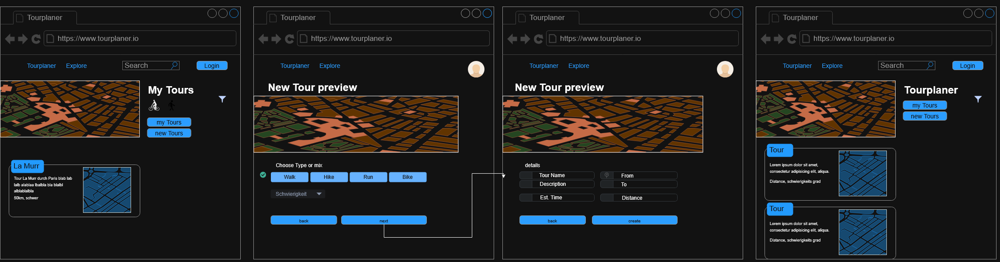
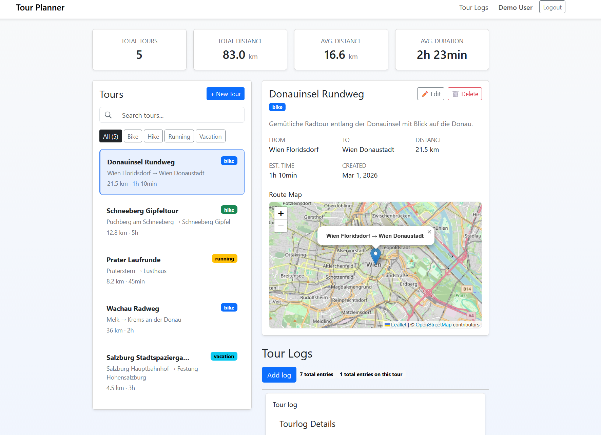

# SWEN2 Route Planner

## Intermediary Submission Documentation

## 1. Project Overview

The goal of this project is to build a web-based route planner application that allows users to create tours and document completed tours using tour logs.

The final system will consist of an Angular frontend and a backend service implemented with a middleware framework. The backend will handle business logic, persistent data storage, and communication with external APIs.

This intermediary submission mainly focuses on the frontend structure and user interface. The current implementation demonstrates the general application layout, navigation between pages, and basic frontend state management.

At the current stage the application already allows users to:

* register and log in using a local demo authentication flow
* view and edit a user profile
* create, edit, and delete tours
* search and filter tours
* view a map component for the selected tour
* create and manage tour logs for a selected tour

Some parts of the application still use mock data or frontend-only logic and will be replaced with proper backend functionality in the final stage.

---

## 2. Technology Stack

The current implementation uses the following technologies:

* **Angular 21** with standalone components
* **TypeScript**
* **Angular Router**
* **Angular Reactive Forms**
* **Angular Signals** for reactive state management
* **Bootstrap 5** for styling and layout
* **Leaflet** for map rendering
* **Angular SSR / Express setup** generated by Angular

### Why these technologies were used

Angular was chosen because it provides a clear structure for larger frontend applications.
Reactive Forms are used to handle user input and validation.
Bootstrap helps create a responsive UI quickly.
Leaflet is used to display the map component for the tour view.

---

## 3. Current Functionality

### 3.1 Authentication

Authentication is currently implemented on the frontend only.

Features:

* login page
* registration page
* logout functionality
* route protection using an authentication guard
* session persistence using `localStorage`
* seeded demo user

Demo credentials:

Email: `demo@tourplanner.local`
Password: `demo1234`

---

### 3.2 Profile Management

Authenticated users can access a profile page where they can:

* view their account information
* update username and email
* optionally change their password

---

### 3.3 Tour Management

The **tours dashboard** is the main part of the application.

Features:

* list of tours (currently mock data)
* statistics overview
* search functionality with debounce
* filtering by transport type
* create new tours
* edit existing tours
* delete tours
* detail view for the selected tour
* map display for the selected tour

Tours are currently stored only in frontend state and will reset when the application reloads.

---

### 3.4 Tour Logs

Tour logs allow users to document completed tours.

Implemented features:

* list of logs for the selected tour
* create new logs
* edit existing logs
* delete logs
* form validation
* filtering logs by tour and user

Tour logs are currently stored only in memory and will reset when the page reloads.

---

### 3.5 Map Integration

The application includes a **Leaflet-based map component**.

Current functionality:

* map display for the selected tour
* marker and popup visualization
* popup displays start and destination information

Leaflet is successfully integrated and the map component is functional.  
Currently the map shows a static marker at a default location in Vienna.

---

## 4. Architecture

The frontend already follows a structured architecture.

### 4.1 Routing

Angular Router is used to manage navigation.

Implemented routes include:

* `/login`
* `/register`
* `/tours`
* `/tourlogs`
* `/profile`

Protected routes are guarded by an `authGuard`, which redirects unauthenticated users to the login page.

---

### 4.2 MVVM Pattern

The application follows the **Model–View–ViewModel (MVVM)** pattern commonly used in Angular applications.

**Model**

TypeScript types such as `Tour` and `Log` represent the domain model.

**ViewModel**

Angular services such as `AuthService`, `TourService`, and `TourlogsModel` manage application state and business logic.

**View**

Angular components and templates provide the user interface.

This separation improves maintainability and makes the system easier to extend.

---

### 4.3 State Management

Application state is managed using **Angular Signals**.

Examples:

* authentication state in `AuthService`
* tour state in `TourService`
* tour log state in `TourlogsModel`

Singals make the UI update reactvely.

---

### 4.4 Forms and Validation

Reactive forms are used throughout the application.

They are implemented for:

* login
* registration
* profile management
* tour creation and editing
* tour log creation and editing

---

## 5. Project Structure

The project is organized into several feature-based components and services.

Important folders include:

src/app/auth/ - authentication service and guard
src/app/login/ - login page
src/app/register/ - registration page
src/app/profile/ - profile page
src/app/tours/ - tours dashboard
src/app/tourlogs/ - tour log functionality
src/app/services/ - application services
src/app/shared/ - reusable UI components

This structure supports modular development and supports MVVM structure.

---

## 6. Build and Run Instructions

#### Requirements

* Node.js
* npm

#### Install dependencies

npm install

#### Start development server

npm run start

The application runs at:

http://localhost:4200

#### Production build

npm run build

The project currently builds successfully.
Angular reports some warnings, but there are no blocking build errors.

---

## 7. Wireframes

This section shows the evolution of the user interface from the initial design concept to the current implementation.

### Initial Wireframe

### Current Interface

### UX Changes

During development several adjustments were made:

- The layout of the tours dashboard was simplified.
- Tour logs were integrated into the tour view.
- The map component was added to visualize tour locations.
- The tour creation workflow was simplified compared to the original concept.

---

## 8. Conclusion

The current version represents a **functional frontend prototype** of the route planner application.

The main user workflows are already implemented:

* authentication
* protected navigation
* tour management
* tour log management

The architecture is prepared for backend integration and further extension.
